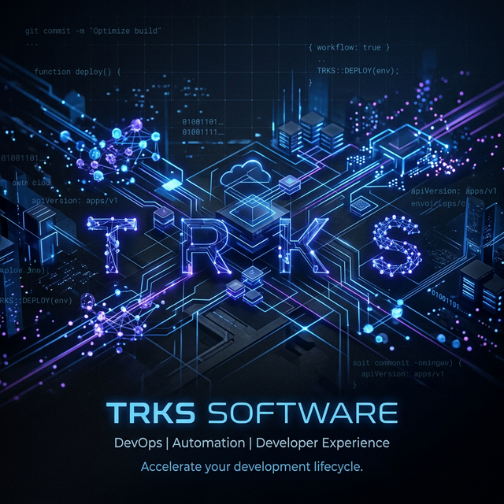

  

    

  <h3>Empowering Developers with Next-Generation DevOps Tooling & Productivity Solutions.</h3>

---

## 🌟 About Us

At **TRKS Software**, we specialize in building enterprise-grade tools that eliminate friction in the software development lifecycle. Our mission is to enhance developer productivity, streamline CI/CD pipelines, and bring clarity to complex engineering workflows. 

We are the creators of powerful **Azure DevOps extensions** designed to keep modern engineering teams *in the zone*.

 

## 🛠️ Our Tech Stack

  
  
  
  
  
  

 

---

## 🚀 Featured Products

<table align="center">
  <tr>
    <td align="center" width="50%">
      <h3>🎯 Focus-Mode</h3>
      
A premium extension that provides a distraction-free interface, automated time tracking, AI-powered ticket analysis, a standup generator, and a Git branch scaffolder.

      
    </td>
    <td align="center" width="50%">
      <h3>📊 Sentinel Dashboard</h3>
      
Monitor your active execution fabric. Get live data for running pipelines and classic release telemetry right inside your Azure DevOps environment in real-time.

      
    </td>
  </tr>
</table>

 

---

## 📈 Open Source & Community

We believe in giving back to the developer community. We are constantly building and releasing open-source utilities to make engineering easier. Check out our telemetry below!

 

  
  

 

---

  <i>"Building the tools we wish we had."</i>  
  <b>© 2026 TRKS Software. All rights reserved.</b>

